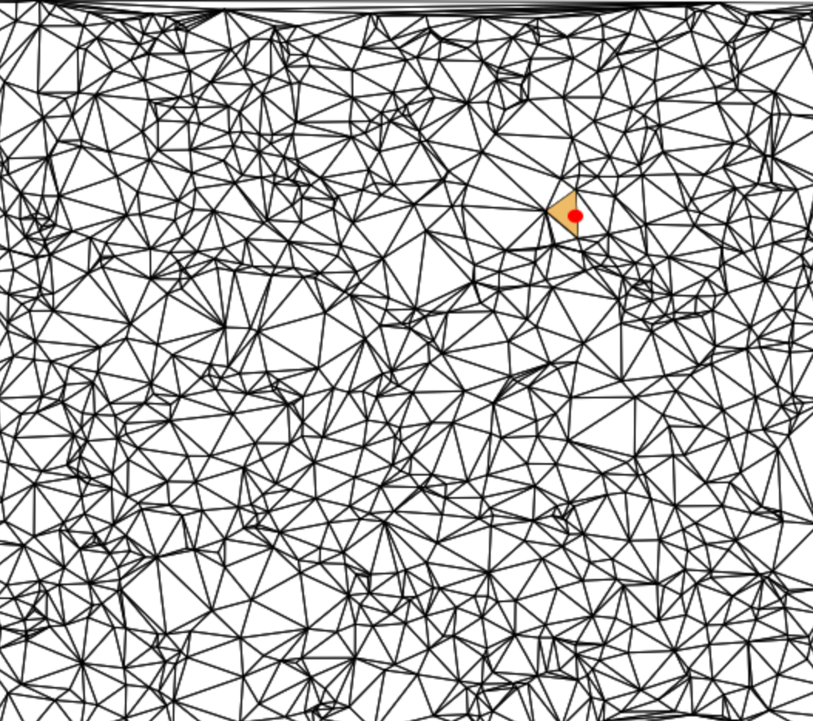

point-in-region
===============
[Locates a point](http://en.wikipedia.org/wiki/Point_location) in a collection of regions.  Point location is exact, takes O(log(n)) time, and the data structure has a space requirement of O(n log(n)).

# Example

```javascript
//First create a list of vertices
var vertices = [
  [0, 0],
  [1, 0],
  [1, 1],
  [0, 1],
  [2, 0],
  [3, 0],
  [3, 1],
  [2, 1],
  [2.25, 0.25],
  [2.75, 0.25],
  [2.75, 0.75],
  [2.25, 0.75]
]

//Regions are defined by lists of loops of vertex indices
var regions = [
  //First region, just a square, one loop
  [ 
    [0, 1, 2, 3]
  ],
  //Second region, square with a hole in the middle
  [
    [4, 5, 6, 7],
    [11, 10, 9, 8]    //Note inner loop has opposite orientation
  ]
]

//Now we create the data structure
var classifyPoint = require("point-in-region")(vertices, regions)

//And we can use it to classify which region contains a given point
var assert = require("assert")
assert.equal(classifyPoint([0.5, 0.5]), 0)
assert.equal(classifyPoint([2.1, 0.1]), 1)
assert.equal(classifyPoint([100000, 10000]), -1)  //Outside points return -1
assert.equal(classifyPoint([2.5, 0.5]), -1)  //Point in center hole is outside region
```

[Here is an in browser demo you can try out yourself:](https://mikolalysenko.github.io/point-in-region)




# Install

```
npm install point-in-region
```

# API

### `var classify = require("point-in-region")(positions, regions)`
Preprocesses a collection of regions to answer point location queries efficiently.

* `positions` is a list of vertex positions for each of the regions
* `regions` is a list of regions encoded as lists of clockwise oriented loops of indices

**Returns** A point membership classification function for the region set

**Note** The regions must obey certain topological and geometric properties for this classification to be correct.  Specifically:

* Any two edges are either disjoint, identical, or meet at exactly one common end point
* The interior of each edge touches at most two regions

### `classify(point)`
Returns the index of the region containing `point`

* `point` is a 2D point encoded as a length 2 array

**Returns** The index of the region containing `point` or `-1` if it is not in any region.

# Credits
(c) 2014 Mikola Lysenko. MIT License